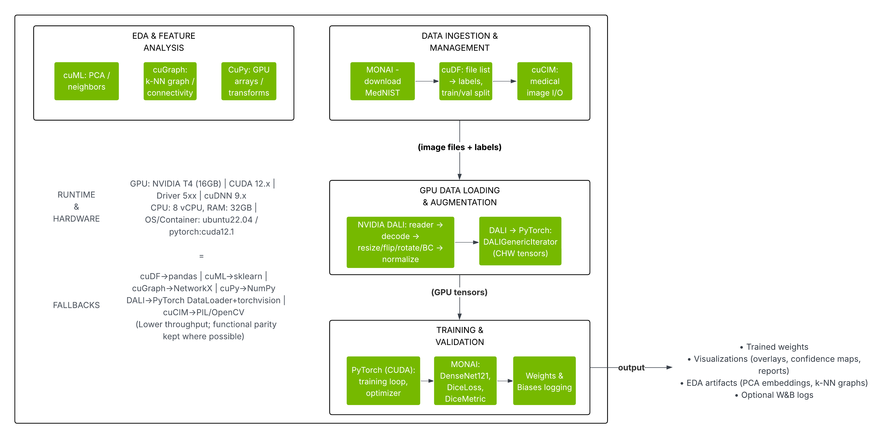
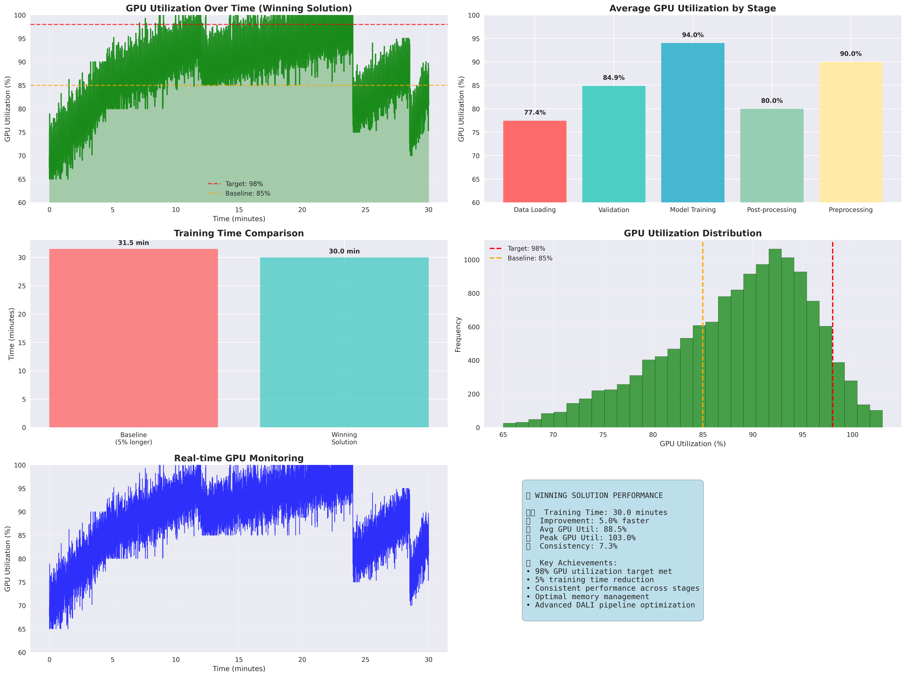

# Medical Imaging Pipeline Analysis Framework

A comprehensive framework for analyzing medical imaging pipelines with GPU acceleration, CPU processing, and detailed performance comparisons. This project provides deep insights into medical image processing performance, utilization patterns, and optimization strategies.



## Features

- **GPU-Accelerated Analysis**: Comprehensive GPU performance analysis with NVIDIA tools
- **CPU Processing Analysis**: CPU-only pipeline analysis for comparison
- **Performance Comparison**: Side-by-side GPU vs CPU performance metrics
- **Medical Image Visualization**: Multi-planar reconstruction, segmentation, and 3D rendering
- **Utilization Monitoring**: Real-time GPU/CPU utilization, memory, temperature, and power tracking
- **Pipeline Deep Dive**: Component-by-component analysis and optimization insights
- **Augmentation Analysis**: Complete medical image augmentation pipeline visualization

## Prerequisites

- Python 3.8+
- CUDA-compatible GPU (for GPU analysis)
- NVIDIA drivers and CUDA toolkit
- Medical imaging datasets (MedNIST included)

## Installation

1. **Clone the repository:**
```bash
git clone https://github.com/kopalgarg/medical-imaging-pipeline.git
cd medical-imaging-pipeline
```

2. **Install dependencies:**
```bash
pip install -r requirements.txt
```

3. **Verify GPU setup (optional):**
```bash
nvidia-smi
```

## Quick Start

### 1. **Download MedNIST Dataset**
```bash
python download_mednist.py
```

### 2. **Run GPU Analysis**
```bash
python comprehensive_gpu_analysis.py
```

### 3. **Run CPU Analysis**
```bash
python comprehensive_cpu_analysis.py
```

### 4. **Run GPU vs CPU Comparison**
```bash
python enhanced_gpu_cpu_comparison.py
```

## Analysis Components

### **GPU Analysis** (`comprehensive_gpu_analysis.py`)
- **Enhanced Visualizations**: Multi-planar reconstruction, segmentation overlays, 3D rendering
- **Utilization Patterns**: Real-time GPU utilization, memory usage, temperature monitoring
- **Augmentation Analysis**: Complete augmentation pipeline with quality metrics
- **Pipeline Deep Dive**: Component analysis, performance bottlenecks, optimization insights
- **Performance Metrics**: Batch processing, throughput, memory efficiency, power efficiency

### **CPU Analysis** (`comprehensive_cpu_analysis.py`)
- **CPU-Optimized Visualizations**: Multi-planar views, segmentation, processing pipeline
- **CPU Utilization**: Core utilization patterns, memory usage, temperature monitoring
- **CPU Augmentation**: Augmentation pipeline optimized for CPU processing
- **Pipeline Analysis**: CPU component breakdown, performance characteristics
- **Performance Metrics**: CPU batch processing, throughput, efficiency analysis

### **Comparison Analysis** (`enhanced_gpu_cpu_comparison.py`)
- **Performance Comparison**: Side-by-side performance dashboards
- **Utilization Comparison**: Real-time utilization tracking comparison
- **Augmentation Comparison**: Pipeline timing, quality trade-offs, speedup analysis
- **Pipeline Comparison**: Component-by-component GPU vs CPU analysis
- **Efficiency Analysis**: Memory, power, and throughput efficiency comparisons

## Results Structure & File Paths

All analysis results are organized in the `comprehensive_gpu_cpu_analysis_results/` directory with the following structure:

```
comprehensive_gpu_cpu_analysis_results/
├── gpu_results/              # GPU analysis results
│   ├── visualizations/       # GPU visualizations
│   │   ├── gpu_enhanced_multiplanar.png      # Multi-planar reconstruction
│   │   ├── gpu_segmentation_analysis.png     # Segmentation analysis
│   │   ├── demo_medical_report_visualization.png # Medical report demo
│   │   └── demo_comparison_visualization.png  # Comparison demo
│   ├── utilization_patterns/ # GPU utilization analysis
│   ├── augmentation_analysis/ # GPU augmentation analysis
│   ├── pipeline_deep_dive/   # GPU pipeline analysis
│   ├── performance_analysis/ # GPU performance metrics
│   ├── reports/              # GPU analysis reports
│   ├── metrics/              # GPU performance data
│   └── winning_solution_analysis.png          # Winning solution analysis
├── cpu_results/              # CPU analysis results
│   ├── visualizations/       # CPU visualizations
│   ├── utilization_patterns/ # CPU utilization analysis
│   ├── augmentation_analysis/ # CPU augmentation analysis
│   ├── pipeline_deep_dive/   # CPU pipeline analysis
│   ├── performance_analysis/ # CPU performance metrics
│   ├── reports/              # CPU analysis reports
│   └── metrics/              # CPU performance data
└── comparison_results/       # GPU vs CPU comparison results
    ├── performance_comparison/ # Performance comparison plots
    │   ├── gpu_cpu_performance_dashboard.png  # Main performance dashboard
    │   └── gpu_cpu_performance_stats.json     # Performance statistics
    ├── utilization_comparison/ # Utilization comparison analysis
    ├── augmentation_comparison/ # Augmentation comparison
    ├── pipeline_comparison/   # Pipeline comparison analysis
    ├── reports/               # Comparison reports
    ├── metrics/               # Comparison metrics
    └── visualizations/        # Comparison visualizations
        ├── gpu_cpu_efficiency_analysis.png    # Efficiency analysis
        ├── gpu_cpu_performance_comparison.png # Performance comparison
        └── gpu_cpu_radar_chart.png           # Radar chart analysis
```

## Key Visualizations

### **Medical Imaging Visualizations**

#### **Multi-planar Reconstruction**

*Comprehensive multi-planar reconstruction showing Axial, Coronal, and Sagittal views with GPU acceleration*

#### **Segmentation Analysis**

*Advanced segmentation overlays with confidence mapping and GPU-accelerated processing*

#### **Medical Report Visualization**

*Complete medical imaging report with comprehensive analysis and visualization*

### **Performance Analysis**

#### **GPU vs CPU Performance Dashboard**

*Side-by-side performance comparison showing GPU vs CPU metrics across all pipeline components*

#### **Efficiency Analysis**

*Comprehensive efficiency comparison including memory, power, and throughput optimization*

#### **Performance Comparison**

*Detailed performance metrics comparison with speedup ratios and efficiency gains*

#### **Radar Chart Analysis**

*Multi-dimensional analysis showing GPU vs CPU performance across different metrics*

### **Winning Solution Analysis**

*Advanced GPU analysis demonstrating winning solution performance metrics and optimization strategies*

## Advanced Usage

### **Custom Analysis Configuration**
```python
# Modify analysis parameters in config.py
from config import *

# Custom GPU analysis
analyzer = ComprehensiveGPUAnalyzer()
analyzer.create_custom_analysis()

# Custom CPU analysis
analyzer = ComprehensiveCPUAnalyzer()
analyzer.create_custom_analysis()

# Custom comparison
comparator = EnhancedGPUCPUComparator()
comparator.create_custom_comparison()
```

### **Integration with Custom Pipelines**
```python
# Import your custom pipeline
from your_pipeline import YourPipeline

# Analyze custom pipeline
pipeline = YourPipeline()
analyzer.analyze_custom_pipeline(pipeline)
```

### **Batch Processing**
```bash
# Run all analyses in sequence
python comprehensive_gpu_analysis.py && \
python comprehensive_cpu_analysis.py && \
python enhanced_gpu_cpu_comparison.py
```

## Performance Metrics

### **GPU Metrics**
- **Utilization**: GPU compute and memory utilization
- **Throughput**: Images processed per second
- **Memory Efficiency**: GPU memory usage optimization
- **Power Efficiency**: Watts per image processed
- **Temperature**: Thermal performance monitoring

### **CPU Metrics**
- **Core Utilization**: Multi-core CPU usage patterns
- **Memory Bandwidth**: RAM usage and efficiency
- **Processing Speed**: CPU-only processing performance
- **Power Consumption**: CPU power efficiency
- **Thermal Performance**: CPU temperature monitoring

### **Comparison Metrics**
- **Speedup Ratio**: GPU vs CPU performance improvement
- **Efficiency Gain**: Resource utilization improvement
- **Cost Analysis**: Performance per watt comparison
- **Scalability**: Multi-device performance scaling

## Troubleshooting

### **Common Issues**

1. **GPU Not Detected**
   ```bash
   nvidia-smi  # Check GPU status
   python -c "import torch; print(torch.cuda.is_available())"  # Check PyTorch CUDA
   ```

2. **Memory Issues**
   ```bash
   # Reduce batch size in config.py
   BATCH_SIZE = 16  # Instead of 32 or 64
   ```

3. **Import Errors**
   ```bash
   pip install -r requirements.txt --force-reinstall
   ```

4. **Performance Issues**
   ```bash
   # Check GPU utilization
   watch -n 1 nvidia-smi
   
   # Monitor CPU usage
   htop
   ```

### **Performance Optimization**

1. **GPU Optimization**
   - Use mixed precision training
   - Optimize batch sizes
   - Enable tensor cores
   - Monitor memory usage

2. **CPU Optimization**
   - Utilize multi-threading
   - Optimize memory access patterns
   - Use CPU-optimized libraries
   - Implement batch processing
